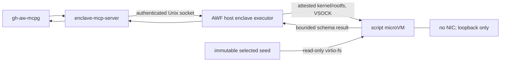
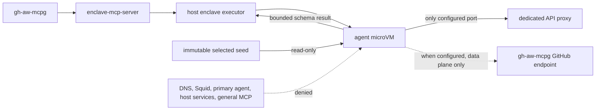
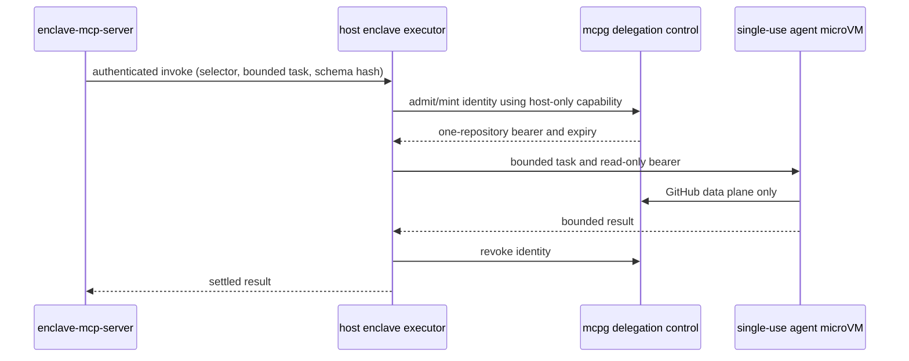

# ADR 0002: Cloud Hypervisor enclave executor

## Status

Proposed for implementation planning. This ADR is a contract, not a statement
that `cloud-hypervisor` is an available enclave runtime. Until all gates below
are implemented, a configuration selecting it fails closed; it does not fall
back to Docker, gVisor, sbx, or the primary-agent Cloud Hypervisor runtime.

## Context

Today's enclave broker (`enclave-mcp-server`) launches untrusted Docker-based
enclaves. Separately, the Cloud Hypervisor preview runs one primary-agent VM per
AWF run. A per-invocation microVM must not give the broker KVM, TUN, netns,
cgroup, artifact, or host-cleanup authority. This ADR defines the new path:

```text
gh-aw-mcpg -> enclave-mcp-server -> authenticated private Unix socket
           -> AWF host enclave executor -> single-use Cloud Hypervisor microVM
```

`gh-aw-mcpg` and the AWF enclave MCP backend remain host/container-side. They
are not moved into a microVM.

## Decision

The AWF control process owns one host enclave executor for the run. It reuses
the attested Cloud Hypervisor, `virtiofsd`, cgroup, network, VSOCK, and
orphan-recovery controls described in
[the Cloud Hypervisor foundation](../cloud-hypervisor-foundation.md), but
creates one VM per accepted enclave invocation.

The initial release supports **static script and static agent** executors.
Dynamic agent execution is enabled only after the existing ADR 0001 delegation
gates and the microVM dynamic-credential handoff are implemented. Custom
enclave image overrides are unsupported initially: script and agent rootfs
roles are AWF-release artifacts in the verified manifest. An override is a
terminal preflight error, not an unverified local-image escape hatch.

### Trust and lifecycle responsibilities

| Component | Trust boundary and authority | Must not receive or control | Cleanup owner |
| --- | --- | --- | --- |
| Primary agent | Calls only compiler-exposed MCP tools and receives finite results | Broker socket, seeds, host capability, guest credential, runtime controls | None |
| `gh-aw-mcpg` | Compiler-owned gateway and optional GitHub data plane | KVM, host executor capability, delegation-control capability | Its owner; AWF only disconnects its own attachment |
| `enclave-mcp-server` | Validates public tool input, serializes admissions, applies the trusted policy | KVM, TAP, host paths, credentials, arbitrary launch controls | Settles each invocation with the host executor |
| AWF host enclave executor | Authenticates broker requests; verifies artifacts; owns VM, VSOCK, `virtiofsd`, netns/TAP, cgroup, cancellation, recovery and audit | Caller-controlled commands, paths, mounts, environment, endpoints, credentials, images, or limits | Itself, including durable orphan reconciliation |
| Cloud Hypervisor and `virtiofsd` | Untrusted-workload containment; run only under verified confinement and cgroups | Host-wide privileges, arbitrary exports, credential files | Host executor reaps and verifies removal |
| Guest supervisor and workload | Executes AWF-derived, bounded guest operation and returns bounded result | Host socket/capability, control plane, raw protected state | Guest stops on cancel; host executor tears it down |
| Dedicated API proxy | Injects model credential for its one configured listener | Repository seed, delegation control, guest filesystem | Existing infrastructure owner |
| Static seeds / dynamic identity | Seed is immutable and selected from the trusted catalog; dynamic identity is one-repository, short-lived and revocable | Primary agent, control capability, other invocation state | Host executor removes/revokes them |

The broker is trusted to submit only policy-derived metadata, but the host
executor independently validates it. Neither trust in the broker nor Unix-socket
location authorizes a request.

## Invocation data flows

### Static script



### Static agent



### Dynamic agent



The delegation-control endpoint and its capability terminate at the host
executor. They never enter the guest, a virtio-fs export, VSOCK payload, or
broker-visible diagnostic.

## Broker-to-host protocol

The executor listens on a per-run AF_UNIX `SOCK_SEQPACKET` socket below a
root-owned `0700` AWF runtime directory. The socket is owned by the dedicated
broker identity and mode `0600`; peer credentials must match that identity.
Each run generates an unguessable, mode-`0600` capability. A request needs both
the peer credential and the capability, is bound to the run, and the capability
is destroyed during shutdown. This is defense in depth, not authorization by
filesystem topology alone.

Each packet is one UTF-8 JSON object, at most 64 KiB, with no duplicate keys and
`additionalProperties: false`. It has `version: 1`, `type`, `requestId`,
`invocationId`, `capability`, and the following closed payload:

| Type | Allowed policy-derived fields |
| --- | --- |
| `invoke` | executor kind, static seed ID **or** canonical dynamic selector, bounded script/task bytes, finite result-schema hash, admission/ledger ID |
| `cancel` | invocation ID and cancellation generation |
| `settle` | invocation ID and broker acknowledgement of the terminal result |
| `status` | request ID and invocation ID |

The broker cannot submit a command, argv, path, mount, environment variable,
network endpoint, credential, image, model, resource policy, UID/GID, timeout,
or output limit. The executor resolves all of those from the already validated
enclave entry and rejects unknown fields, invalid UTF-8, oversize packets,
duplicate request IDs, wrong peers/capabilities, and requests after admission
closure.

`requestId` is a 128-bit random value. `invoke` idempotency is
`(run ID, enclave entry ID, invocation ID)` and records the accepted immutable
request hash before VM creation. The same tuple and hash returns the same
in-progress or settled record; a differing hash is terminal. The executor
persists enough state to reconcile a broker restart, while never replaying a
guest workload. A response is similarly bounded to 64 KiB and uses a canonical
redacted failure for authorization, policy, and infrastructure denial.

Version `1` is exact-match only. There is no downgrade or feature probing:
unknown versions or types fail closed. A future incompatible change uses a new
socket protocol version and explicit mutual support; the host-to-guest channel
continues to use the independently versioned `GUEST_PROTOCOL_VERSION`.

## Network contract

The netns/nftables policy is the enforcement boundary; guest proxy variables
are compatibility aids only.

| Destination / capability | Script VM | Agent VM | Enforcement |
| --- | --- | --- | --- |
| Loopback | Allow | Allow | Guest loopback |
| NIC / external network | Deny (no NIC) | Deny except rows below | No device / per-VM netns |
| Dedicated API proxy selected port | Deny | Allow | Exact address, port, and egress rule |
| Configured mcpg GitHub data-plane endpoint | Deny | Allow only when GitHub tools are configured | Exact address, port, and route |
| Delegation-control endpoint | Deny | Deny | Not routed or mounted |
| DNS | Deny | Deny | No resolver egress rule |
| Squid | Deny | Deny | Explicit deny |
| Host services / metadata | Deny | Deny | Namespace firewall |
| Primary agent / general MCP route / unrelated containers | Deny | Deny | No route and explicit deny |

The agent VM does not gain broader connectivity if its proxy or mcpg peer fails;
it fails closed.

## Filesystem and credential contract

Host VFS policy, not a guest read/write flag, enforces exports.

| Material | Guest visibility | Mode and lifetime |
| --- | --- | --- |
| Selected static seed and immutable inputs | Selected VM only | Read-only, one invocation |
| Bounded result/output directory | Selected VM only | Writable, size-limited, removed after settlement |
| Rootfs, supervisor, runtime files | VM only | Verified immutable artifacts; invocation-private mutable overlay |
| Protected host session/audit state | None | Host executor only, mode `0600` |
| Static GitHub data-plane identity | Agent only when configured | Read-only invocation-private file; removed on teardown |
| Dynamic bearer | Admitted agent only | Read-only, one invocation; expiry no later than timeout; revoke on every terminal path |
| Delegation-control endpoint/capability | None | Host executor only |

## Required Docker-equivalent limits

| Current enclave control | MicroVM equivalent and required result |
| --- | --- |
| Memory and memory-swap | cgroup v2 memory limit and swap limit; OOM is terminal |
| CPU | cgroup v2 CPU quota/weight derived from `cpuLimit` |
| PIDs | cgroup v2 `pids.max` |
| `/tmp`, shared memory, writable storage | Size-limited guest tmpfs/overlay and bounded output export |
| File size and open files | Supervisor sets `RLIMIT_FSIZE=256 MiB` and `RLIMIT_NOFILE=1024` before workload |
| Non-root UID/GID | Supervisor executes the fixed policy UID/GID; no caller override |
| Read-only root, dropped capabilities, no-new-privileges, seccomp | Immutable rootfs plus guest policy; VMM and `virtiofsd` retain verified Landlock/seccomp/no-new-privileges confinement |
| Timeout and output | Host-enforced wall timeout and `maxOutputBytes`; only schema-valid result crosses boundary |

An implementation must reject a configuration if any row cannot be enforced;
it must not silently provide weaker isolation.

## Terminal paths, audit, and recovery

| Event | Settlement | Identity | Cleanup |
| --- | --- | --- |
| Valid completion | One bounded result | Revoke dynamic bearer | Stop VM; unmount; reap VMM/virtiofsd; remove netns/cgroup/files |
| Cancellation or timeout | Canonical cancelled/timed-out result | Revoke | Same cleanup; timeout is terminal |
| Guest crash or OOM | Canonical executor failure | Revoke | Same cleanup; preserve redacted cause only |
| Broker or executor crash | Do not rerun workload automatically | Revoke during recovery | Durable record reconciles resources by boot ID, PID start time, inode/ifindex and lease |
| mcpg/data-plane failure | Terminal failure | Revoke if minted | Same cleanup |
| Cleanup/revocation failure | Terminal; admissions close | Retry idempotent revocation during recovery | Preserve validated recovery record; fail closed for later microVM admissions |

Before allocating resources, the executor creates an invocation-labelled,
root-owned `0600` durable recovery record under the existing Cloud Hypervisor
recovery hierarchy. Reconciliation never trusts a name or PID alone and is
idempotent. Settlement is written before destroying protected state.

Audit records contain opaque invocation/resource identifiers, policy and
artifact versions, timing and resource buckets, terminal state, revocation, and
cleanup state. They never preserve raw repository-derived guest stdout or
stderr—not even in a private diagnostic tail. The live stream is filtered and
discarded after byte count and digest accounting; free-form diagnostics are
redacted. This is stricter than primary-agent microVM diagnostics because an
enclave result crosses a private-repository boundary.

## Compatibility, gates, and non-goals

Docker, gVisor, and sbx executor behavior remains unchanged. Mixed runtime
entries may coexist only after each selected runtime independently passes its
preflight; no invocation may select a fallback runtime. Initial Cloud
Hypervisor enclave rollout is additionally gated on:

1. an AWF release implementing this socket, recovery, matrices, and parity
   checks;
2. pinned, manifest-attested Cloud Hypervisor, `virtiofsd`, kernel, role rootfs,
   and guest supervisor artifacts on a supported GitHub-hosted Ubuntu x86_64 KVM
   runner;
3. exact compatible guest-supervisor and host guest-protocol versions; and
4. for dynamic agents, the ADR 0001 compiler handoff and mcpg v0.4.18-or-newer
   delegation controller (v0.4.17 decoded wire TTL seconds as nanoseconds).

Unsupported hosts, artifacts, protocol versions, executor kinds, image
overrides, and mixed configurations fail closed. Non-goals are arbitrary guest
egress, custom guest images, moving mcpg or the enclave MCP backend into a VM,
and changing Docker/gVisor/sbx semantics.

## Blocking follow-ups

The AWF runtime maintainer owns implementation issues for the socket protocol
test suite, role-specific artifact-manifest entries, and microVM resource-parity
verification. The gh-aw/mcpg maintainers own a versioned dynamic bearer handoff
that proves the control capability cannot enter the guest. Neither dynamic
microVM agents nor general availability may ship until these issues are closed.
