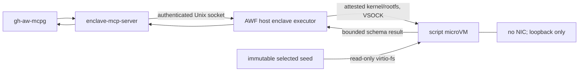
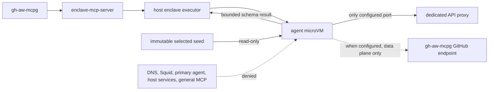
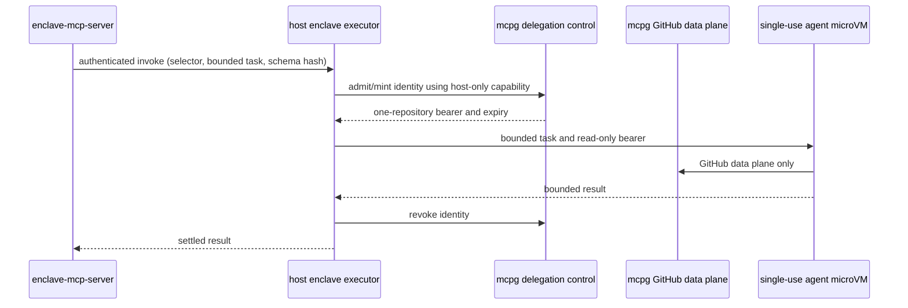

# ADR 0002: Cloud Hypervisor enclave executor

## Status

Implementation in progress. The host-side protocol and single-invocation
backend are implemented, but they are not wired into user-facing runtime
selection. A configuration selecting Cloud Hypervisor enclaves still fails
closed; it does not fall back to Docker, gVisor, sbx, or the primary-agent
Cloud Hypervisor runtime.

## Context

Today's enclave broker (`enclave-mcp-server`) launches untrusted Docker-based
enclaves. Separately, the Cloud Hypervisor preview runs one primary-agent VM per
AWF run. A per-invocation microVM must not give the broker KVM, TUN, netns,
cgroup, artifact, or host-cleanup authority. This ADR defines the new path:

```text
gh-aw-mcpg -> enclave-mcp-server -> authenticated private Unix socket
           -> AWF host enclave executor -> single-use Cloud Hypervisor microVM
```

`gh-aw-mcpg` and the AWF enclave MCP backend remain host/container-side. They
are not moved into a microVM.

## Decision

The AWF control process owns one host enclave executor for the run. It reuses
the attested Cloud Hypervisor, `virtiofsd`, cgroup, network, VSOCK, and
orphan-recovery controls described in
[the Cloud Hypervisor foundation](../cloud-hypervisor-foundation.md), but
creates one VM per accepted enclave invocation.

The initial release supports **static script and static agent** executors.
Dynamic agent execution is enabled only after the existing ADR 0001 delegation
gates and the microVM dynamic-credential handoff are implemented. Custom
enclave image overrides are unsupported initially: script and agent rootfs
roles are AWF-release artifacts in the verified manifest. An override is a
terminal preflight error, not an unverified local-image escape hatch.

### Trust and lifecycle responsibilities

| Component | Trust boundary and authority | Must not receive or control | Cleanup owner |
| --- | --- | --- | --- |
| Primary agent | Calls only compiler-exposed MCP tools and receives finite results | Broker socket, seeds, host capability, guest credential, runtime controls | None |
| `gh-aw-mcpg` | Compiler-owned gateway and optional GitHub data plane | KVM, host executor capability, delegation-control capability | Its owner; AWF only disconnects its own attachment |
| `enclave-mcp-server` | Validates public tool input, serializes admissions, applies the trusted policy | KVM, TAP, host paths, credentials, arbitrary launch controls | Settles each invocation with the host executor |
| AWF host enclave executor | Authenticates broker requests; verifies artifacts; owns VM, VSOCK, `virtiofsd`, netns/TAP, cgroup, cancellation, recovery and audit | Caller-controlled commands, paths, mounts, environment, endpoints, credentials, images, or limits | Itself, including durable orphan reconciliation |
| Cloud Hypervisor and `virtiofsd` | Untrusted-workload containment; run only under verified confinement and cgroups | Host-wide privileges, arbitrary exports, credential files | Host executor reaps and verifies removal |
| Guest supervisor and workload | Executes AWF-derived, bounded guest operation and returns bounded result | Host socket/capability, control plane, raw protected state | Guest stops on cancel; host executor tears it down |
| Dedicated API proxy | Injects model credential for its one configured listener | Repository seed, delegation control, guest filesystem | Existing infrastructure owner |
| Static seeds / dynamic identity | Seed is immutable and selected from the trusted catalog; dynamic identity is one-repository, short-lived and revocable | Primary agent, control capability, other invocation state | Host executor removes/revokes them |

The broker is trusted to submit only policy-derived metadata, but the host
executor independently validates it. Neither trust in the broker nor Unix-socket
location authorizes a request.

## Invocation data flows

### Static script


```mermaid
flowchart LR
  M[gh-aw-mcpg] --> B[enclave-mcp-server]
  B -->|authenticated Unix socket| H[AWF host enclave executor]
  H -->|attested kernel/rootfs, VSOCK| V[script microVM]
  S[immutable selected seed] -->|read-only virtio-fs| V
  V -->|bounded schema result| H --> B --> M
  V --- N[no NIC; loopback only]
```

### Static agent


```mermaid
flowchart LR
  M[gh-aw-mcpg] --> B[enclave-mcp-server] --> H[host enclave executor]
  H --> V[agent microVM]
  S[immutable selected seed] -->|read-only| V
  V -->|only configured port| P[dedicated API proxy]
  V -. when configured, data plane only .-> G[gh-aw-mcpg GitHub endpoint]
  V -->|bounded schema result| H
  D[DNS, Squid, primary agent, host services, general MCP] -. denied .-> V
```

### Dynamic agent


```mermaid
sequenceDiagram
  participant B as enclave-mcp-server
  participant H as host enclave executor
  participant C as mcpg delegation control
  participant G as mcpg GitHub data plane
  participant V as single-use agent microVM
  B->>H: authenticated invoke (selector, bounded task, schema hash)
  H->>C: admit/mint identity using host-only capability
  C-->>H: one-repository bearer and expiry
  H->>V: bounded task and read-only bearer
  V->>G: GitHub data plane only
  V-->>H: bounded result
  H->>C: revoke identity
  H-->>B: settled result
```

The delegation-control endpoint and its capability terminate at the host
executor. They never enter the guest, a virtio-fs export, VSOCK payload, or
broker-visible diagnostic.

## Broker-to-host protocol

Protocol version 2 uses a per-run AF_UNIX stream socket below a `0700` AWF runtime
directory owned by the AWF control process. Each connection carries one framed
request and one framed response; the client half-closes after its frame, and the
host processes the request only after EOF confirms that no trailing bytes were
sent. Node.js does not expose `SOCK_SEQPACKET` or peer credentials, so v2
authorization uses the per-run 256-bit capability alone. The capability is
written mode `0600`, bound to the run, and destroyed during shutdown. A later
host-executor integration may add peer-credential checks as defense in depth;
they are not part of v2 authorization.

Each request frame contains one UTF-8 JSON object, at most 512 KiB, with no duplicate
keys and
`additionalProperties: false`. It has `version: 2`, `type`, `requestId`,
`runId`, `entryId`, `invocationId`, `capability`, and the following closed payload:

The 512 KiB bound admits a 64 KiB script or task even when JSON escaping expands
each payload byte to six bytes, while retaining space for required metadata.

| Type | Allowed policy-derived fields |
| --- | --- |
| `invoke` | executor kind, static seed ID **or** canonical dynamic selector, bounded script/task bytes, finite result schema and hash, admission/ledger ID |
| `cancel` | cancellation generation |
| `settle` | broker acknowledgement of the terminal result |
| `status` | no additional fields |

The broker cannot submit a command, argv, path, mount, environment variable,
network endpoint, credential, image, model, resource policy, UID/GID, timeout,
or output limit. The executor resolves all of those from the already validated
enclave entry selected by `entryId` and rejects unknown fields, invalid UTF-8, oversize frames,
duplicate request IDs, invalid capabilities, and requests after admission
closure.

`requestId` is a 128-bit random value. `invoke` idempotency is
`(run ID, entry ID, invocation ID)` and records the accepted immutable
request hash before VM creation. The same tuple and hash may return the same
in-progress record; terminal identities cannot be invoked again, and a differing
hash is rejected. Recovery never replays a guest workload or resumes an old
run's capability. A response is similarly bounded to 64 KiB and uses a canonical
redacted failure for authorization, policy, and infrastructure denial.

Version `2` is exact-match only. There is no downgrade or feature probing:
unknown versions or types fail closed. A future incompatible change uses a new
socket protocol version and explicit mutual support; the host-to-guest channel
continues to use the independently versioned `GUEST_PROTOCOL_VERSION`.

### Version 2 implementation

The protocol and concrete host executor backend are implemented, including
release-attested role rootfs preflight, a bounded per-invocation tmpfs, fixed
guest profiles, schema-validated result collection, deadline/cancellation
handling, and VM/storage cleanup. The internal host service composes verified
host/artifact preflight with the authenticated listener. The broker's host
adapter dispatches only after request validation and admission by the shared
information ledger; both roles use the same authenticated channel. It does not
stage local workspaces or launch containers for host-owned invocations.
Production storage admission uses an invocation-owned kernel-bounded allocation
domain on eligible GitHub-hosted Ubuntu x86_64 KVM/cgroup-v2 hosts. It charges
artifact snapshots, prepared/staged rootfs copies, VM runtime state, and all
writable exports against one role ceiling (script 1 GiB, agent 512 MiB).
Executable artifact staging is sealed read-only and writable state is `noexec`;
both share the same allocation accounting. Unsupported hosts fail closed before
staging, listener, or VM creation. There is no environment-variable opt-in or
fallback to an unconfined runtime. Live release-attested broker-to-VM security
acceptance remains tracked separately in #9395; host probes are not that evidence.

Host preflight also uses journaled, short-lived role-bounded storage, sealing
artifact copies before attestation, parsing, hashing, or privileged version
probes. Role-attestation temporary files stay in bounded storage. These domains
are closed before the listener starts; they neither leave shared uncharged
snapshots nor execute mutable original artifact paths.

| Piece | Owner and location |
| --- | --- |
| Wire codec and validation | AWF host, `src/enclave/host-executor-protocol.ts` |
| Listener, replay/idempotency state, trusted plan derivation | AWF host, `src/enclave/host-executor-server.ts` |
| Broker client (mirror of the codec) | `enclave-mcp-server`, `containers/enclave/mcp-server/host-executor-client.js` |
| Broker dispatch, cancellation, and settlement | `containers/enclave/mcp-server/host-executor-runner.js` |
| Preflight/listener composition (internal only) | `src/enclave/cloud-hypervisor-host-service.ts` |
| Contract and rejection tests | `src/enclave/host-executor-protocol.test.ts` (drives the real client against the real server) |
| Trusted one-shot VM executor | `src/cloud-hypervisor/host-enclave-executor.ts` |
| Guest path compatibility | `guest/microvm-supervisor/resources_linux.go` |
| Bounded output tests | `src/cloud-hypervisor/host-enclave-executor.test.ts` |

**Transport.** Node.js exposes only `SOCK_STREAM` Unix sockets and no peer
credentials. Each connection carries exactly one request frame (4-byte
big-endian length, then UTF-8 JSON), receives exactly one response frame, and
is closed. The client half-closes after writing; the host waits for EOF before
processing a complete frame, so trailing bytes are rejected without execution.
A zero or over-512 KiB length is rejected from its header without reading the
body. Connections have an idle timeout and a concurrency cap. The listener's
runtime directory is `0700` and owned by the AWF control process; the socket and
capability file are `0600`. An existing socket or capability file means startup
fails. Peer credentials are unavailable and are not an authorization input in
v2; a later integration may add them as defense in depth.

**Authentication.** The capability is 256 random bits generated per run, written
once with `O_EXCL|O_NOFOLLOW`, and compared in constant time. It is independent
of source address, container identity, socket location, and runtime. On
shutdown, running invocations are aborted, the in-memory capability is zeroed,
and the socket and capability file are removed.

**Requests.** Every request carries `version`, `type`, `requestId` (128-bit hex),
`runId` (must equal the host's run), `entryId` (must select a trusted entry),
`invocationId`, and `capability`. The
type-specific fields are:

| Type | Fields |
| --- | --- |
| `invoke` | `executorKind` (`script`/`agent`), exactly one of `seedId` or `selector` (agent only, canonical lowercase `owner/repo`), `payload` (≤ 64 KiB UTF-8), finite `schema` (≤ 4 KiB) and `schemaHash`, `admissionId` |
| `cancel` | `cancelGeneration` (integer ≥ 1, strictly increasing per invocation) |
| `settle` | `resultDigest` (the digest the host reported for the terminal result) |
| `status` | none |

The host derives the plan handed to the backend from the trusted entry selected
by `entryId` and the trusted run state. The entry identifier must exist in that
run's entry catalog, and its executor kind and policy must match. The seed must
be in that entry's trusted catalog. Seed and invocation host paths are joined
from trusted directories and pattern-checked identifiers. Selector admission
requires dynamic agents to be enabled for that entry, which is not the case
initially. Commands, executables, mounts, environment, networking, runtime
profile, and limits are not expressible.

**Responses and failures.** Success responses carry the invocation `state`
(`running`, `cancelling`, `terminal`, `settled`), `cancelGeneration`, and, once
terminal, `outcome`, `resultDigest`, and a result of at most 8 KiB (`success`
only). Confirmed cancellation reports `cancelled`, but cannot mask an executor
failure. Unconfirmed cleanup remains nonterminal and closes admissions.
A confirmed failing backend result reports `executor-failure` with no detail. Failure codes form a
closed set: `denied`, `replayed`, `conflict`, `unknown-invocation`,
`invalid-state`, and `closed`. Every failure before or during authentication and
validation gets the byte-identical response `{"version":2,"ok":false,"error":"denied"}`.
This covers framing, size, UTF-8, strict JSON, capability, run, version, type,
unknown or prohibited fields, and value checks. Trusted-policy denials also get
`denied`. Authorization and malformed-request rejection cause no launch side
effects. A lifecycle journal failure also aborts existing execution safely.

**Replay and idempotency.** An authenticated `requestId` is accepted at most
once per run and replays get `replayed`. Invocation replay is keyed by
`(run ID, entry ID, invocation ID)`. The immutable request hash includes the
entry ID and is durably recorded before the backend is called. The same hash
returns the existing in-progress record, and a different hash is a `conflict`.
Terminal and settled invocation IDs cannot be invoked again; invocation and
admission IDs cannot be reused under another entry. Settlement requires
a terminal invocation and the matching digest.
It is idempotent once settled and drops the retained result. After
`closeAdmissions()`, new invocations return `closed` (in-progress retries remain
idempotent), while `cancel`, `status`, and
`settle` keep working so the broker can drain. Request-ID and invocation tables
are bounded. Reaching either bound closes admissions. A bounded reserve of
request IDs keeps `cancel`, `status`, and `settle` working for draining.

### Integrated invocation lifecycle

The broker uses the existing shared serialization lane and per-repository
information ledger before dispatch. Neither a host response nor switching roles
resets those budgets. Host-owned invocations bypass broker workspace creation,
local launch, artifact preservation, and output-file collection.

The internal broker contract uses a read-only bind of only the listener's private
runtime directory at `/run/awf-enclave-host-executor`, containing `executor.sock`
and `capability`. The broker must run under the host-authorized identity without
widening directory/socket/file permissions. Trusted run and role entry IDs must
match the host catalog. Neither this bind nor the persistent journal is exposed
to the primary agent or guest. Runtime/Compose activation remains disabled;
removing the rollout gate must first validate this exact custody and shutdown
ordering on a supported host.

The host owns the invocation deadline. Authenticated status polling renews a
15-second host-side liveness lease (trusted host-only range: 1–60,000 ms);
broker disappearance expires the lease and aborts the invocation. The broker
bounds each exchange to four seconds and polls every 25 ms by default.
Cancellation carries an increasing generation and affects
only the recorded invocation. Broker shutdown and interrupted MCP requests
propagate cancellation instead of leaving the VM running.

The host publishes terminal state only after backend execution and cleanup
return and the terminal journal write succeeds. Unconfirmed cleanup remains
nonterminal and closes admissions; it cannot be reported as a completed timeout
or cancellation. The broker verifies the terminal
digest (SHA-256 of JSON `[outcome, result-or-null]`) and finite result schema,
then acknowledges the same digest with `settle`. A public success is possible
only after a matching `settled` response. Failure, timeout, and cancellation
carry no result. Ambiguous transport, protocol, cancellation, or settlement
closes broker admissions, including the shared lane, rather than returning data
or trying another runtime. Guest stdout/stderr and arbitrary backend errors are
never forwarded.

### Restart recovery

The host writes an exclusive, durable run tombstone and invocation/admission
transitions before launch under
`/var/lib/awf-cloud-hypervisor/host-executor-journal`, outside the ephemeral
workspace and broker-visible runtime directory. The journal contains opaque identities, request
hashes, outcomes, and result digests, not payloads, capabilities, credentials, or
results. Even a cleanly closed run cannot restart under the same identity; a torn
or uncertain journal does not authorize resumption.

Invocation storage has a separate write-ahead resource journal, complementing
the existing Cloud Hypervisor VM cleanup registry. Recovery checks process boot
ID/start time and directory/mount identities before touching recorded resources.
VM teardown precedes removal of invocation tmpfs or artifact storage so a live
VM cannot retain an export. Missing already-cleaned resources are handled
idempotently; changed identities, unsafe paths, partial mount state, malformed
records, or failed cleanup are retained for operator recovery and prevent new
execution. Recovery is limited to validated AWF-owned records, never a broad
directory sweep or a PID/name-only kill.

The production storage domain records its invocation-derived paths and durable
mount/device/inode ownership before use. Artifact and writable-state views are
invocation-local, not a global bind mount or an arbitrary trusted path override.
Ordinary unmount must succeed before the domain is released; a failed close
retains the backing allocation limit and recovery state. Durable host recovery
metadata stays outside the ephemeral domain so exhaustion or unmount cannot
erase the no-replay tombstone.

After interruption, recover orphan resources with the trusted host preflight and
cleanup path, retain the old run tombstone, and start a fresh run identity and
broker ledger. Do not manually discard uncertain records to force admission.
There is no automatic workload retry, capability reuse, or reconstruction of a
repository's disclosure balance from guest output.

## Network contract

The netns/nftables policy is the enforcement boundary; guest proxy variables
are compatibility aids only.

| Destination / capability | Script VM | Agent VM | Enforcement |
| --- | --- | --- | --- |
| Loopback | Allow | Allow | Guest loopback |
| NIC / external network | Deny (no NIC) | Deny except rows below | No device / per-VM netns |
| Dedicated API proxy selected port | Deny | Allow | Exact address, port, and egress rule |
| Configured mcpg GitHub data-plane endpoint | Deny | Allow only when GitHub tools are configured | Exact address, port, and route |
| Delegation-control endpoint | Deny | Deny | Not routed or mounted |
| DNS | Deny | Deny | No resolver egress rule |
| Squid | Deny | Deny | Explicit deny |
| Host services / metadata | Deny | Deny | Namespace firewall |
| Primary agent / general MCP route / unrelated containers | Deny | Deny | No route and explicit deny |

The agent VM does not gain broader connectivity if its proxy or mcpg peer fails;
it fails closed.

For the script VM, `no NIC` is enforced by the trusted host workload plan. The
VMM runs in a newly created, run-scoped empty network namespace and its
`vm.create` payload contains no `net` device. Planning accepts no caller-supplied
namespace, interface, bridge, address, route, DNS server, endpoint, or port.
Cleanup records only the namespace and remains idempotent when TAP, veth, bridge,
and route resources were never created.

## Filesystem and credential contract

Host VFS policy, not a guest read/write flag, enforces exports.

| Material | Guest visibility | Mode and lifetime |
| --- | --- | --- |
| Selected static seed and immutable inputs | Selected VM only | Read-only, one invocation |
| Bounded result/output directory | Selected VM only | Writable, size-limited, removed before terminal publication |
| Rootfs, supervisor, runtime files | VM only | Verified immutable artifacts; invocation-private mutable overlay |
| Protected host session/audit state | None | Host executor only, mode `0600` |
| Static GitHub data-plane identity | Agent only when configured | Read-only invocation-private file; removed on teardown |
| Dynamic bearer | Admitted agent only | Read-only, one invocation; expiry no later than timeout; revoke on every terminal path |
| Delegation-control endpoint/capability | None | Host executor only |

## Required Docker-equivalent limits

| Current enclave control | MicroVM equivalent and required result |
| --- | --- |
| Memory and memory-swap | cgroup v2 memory limit and swap limit; OOM is terminal |
| CPU | cgroup v2 CPU quota/weight derived from `cpuLimit` |
| PIDs | cgroup v2 `pids.max` |
| `/tmp`, shared memory, writable storage | Size-limited guest tmpfs/overlay and bounded output export |
| File size and open files | Supervisor sets role-equivalent limits before workload: script `RLIMIT_FSIZE=512 MiB`, agent `RLIMIT_FSIZE=256 MiB`, and `RLIMIT_NOFILE=1024` for both |
| Non-root UID/GID | Supervisor executes the fixed policy UID/GID; no caller override |
| Read-only root, dropped capabilities, no-new-privileges, seccomp | Immutable rootfs plus guest policy; VMM and `virtiofsd` retain verified Landlock/seccomp/no-new-privileges confinement |
| Timeout and output | Host-enforced wall timeout and `maxOutputBytes`; only schema-valid result crosses boundary |

An implementation must reject a configuration if any row cannot be enforced;
it must not silently provide weaker isolation.

## Terminal paths, audit, and recovery

| Event | Settlement | Identity | Cleanup |
| --- | --- | --- |
| Valid completion | One bounded result | Revoke dynamic bearer | Stop VM; unmount; reap VMM/virtiofsd; remove netns/cgroup/files |
| Cancellation or timeout | Canonical cancelled/timed-out result | Revoke | Same cleanup; timeout is terminal |
| Guest crash or OOM | Canonical executor failure | Revoke | Same cleanup; preserve redacted cause only |
| Broker or executor crash | Do not rerun workload automatically | Revoke during recovery | Durable record reconciles resources by boot ID, PID start time, inode/ifindex and lease |
| mcpg/data-plane failure | Terminal failure | Revoke if minted | Same cleanup |
| Cleanup/revocation failure | Nonterminal `cancelling`; admissions close | Retry idempotent revocation during recovery | Preserve validated recovery record; fail closed for later microVM admissions |

Before allocating resources, the executor creates an invocation-labelled,
root-owned `0600` write-ahead resource record in the persistent host-executor
journal, alongside the separate Cloud Hypervisor VM cleanup registry.
Reconciliation never trusts a name or PID alone and is idempotent. Settlement
is durably acknowledged before dropping the retained in-memory result; run and
invocation tombstones survive.

Audit records contain opaque invocation/resource identifiers, policy and
artifact versions, timing and resource buckets, terminal state, revocation, and
cleanup state. They never preserve raw repository-derived guest stdout or
stderr—not even in a private diagnostic tail. The live stream is filtered and
discarded after byte count and digest accounting; free-form diagnostics are
redacted. This is stricter than primary-agent microVM diagnostics because an
enclave result crosses a private-repository boundary.

## Compatibility, gates, and non-goals

Docker, gVisor, and sbx executor behavior remains unchanged. Mixed runtime
entries may coexist only after each selected runtime independently passes its
preflight; no invocation may select a fallback runtime. Initial Cloud
Hypervisor enclave rollout is additionally gated on:

1. an AWF release implementing this socket, recovery, matrices, and parity
   checks;
2. pinned, manifest-attested Cloud Hypervisor, `virtiofsd`, kernel, role rootfs,
   and guest supervisor artifacts on a supported GitHub-hosted Ubuntu x86_64 KVM
   runner;
3. exact compatible guest-supervisor and host guest-protocol versions;
4. supported-host real-KVM validation of the integrated broker boundary,
   enforcement, cancellation, settlement, and restart recovery; and
5. for dynamic agents, the ADR 0001 compiler handoff and mcpg v0.4.18-or-newer
   delegation controller (v0.4.17 decoded wire TTL seconds as nanoseconds).

Unsupported hosts, artifacts, protocol versions, executor kinds, and image
overrides fail closed. Mixed configurations fail closed unless every selected
runtime independently passes preflight. Non-goals are arbitrary guest egress,
custom guest images, moving mcpg or the enclave MCP backend into a VM, and
changing Docker/gVisor/sbx semantics.

### Supported-host real-KVM validation

Socket tests and substituted VM managers validate orchestration, not KVM
isolation. Before removing either runtime-selection or broker-startup gate,
validate the integrated path on a supported GitHub-hosted Ubuntu x86_64 runner
with actual KVM and the pinned, release-attested artifacts:

- Dispatch approved script and agent calls through mcpg, the MCP broker, the
  authenticated host listener, and the real VM. Verify rejection of malformed
  frames, wrong capabilities/runs/entries/seeds, unknown launch fields, and
  identity replays before any launch side effect.
- Probe script no-NIC enforcement and the agent's exact dedicated proxy/mcpg
  destinations, including denied DNS, metadata, host, primary-agent, Squid, and
  unrelated-container access. Confirm host-enforced read-only exports, bounded
  writable storage, cgroups, process/file limits, and privilege dropping.
- Cancel during staging, boot, execution, and result collection; exercise
  timeout and every terminal failure. Verify the VM and filesystem daemons are
  stopped and reaped, namespaces/cgroups/mounts and invocation-private files are
  removed, and identities/admission state settle without a second execution.
- Kill the broker and host at each resource-allocation boundary, then restart
  recovery. Include partial records, stale PID/inode/mount identities, malformed
  records, cleanup failures, and unrelated live resources. Recovery must retain
  uncertain records, refuse new execution, and never remove unrelated resources.
- Put unique canaries in guest stdout/stderr, private repository content,
  credentials, and backend errors. Confirm no canary reaches the primary-agent
  response or ordinary logs; only the admitted canonical finite-schema result
  may be disclosed after confirmed host settlement.

Record artifact/protocol versions and the security matrix results. A failed or
unperformed check keeps the path disabled; test doubles and a successful VM
boot are not sufficient rollout evidence.

## Blocking follow-ups

The AWF runtime maintainer owns implementation issues for the socket protocol
test suite, role-specific artifact-manifest entries, and microVM resource-parity
verification. The gh-aw/mcpg maintainers own a versioned dynamic bearer handoff
that proves the control capability cannot enter the guest. Neither dynamic
microVM agents nor general availability may ship until these issues are closed.
