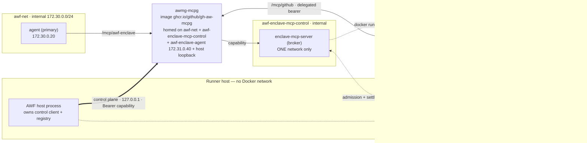

# Unified Enclave Architecture

## Status

Layer 5 establishes one `enclaves` subsystem, one AWF-owned MCP server, and mcpg-only access through the compiler handoff contract.

Dynamic repository admission described below is implemented and version-gated.
It runs only when the gh-aw compiler starts mcpg's
`github-repository-delegation-v1` controller (mcpg v0.4.17 or newer) and hands
AWF its loopback-only control endpoint and AWF-only control capability; every
other combination fails closed before execution. Static entries continue to
declare a non-empty `repos` list and use immutable seeds.

## Architecture

AWF stages immutable repository seeds on the host, starts one AWF-owned `enclave-mcp-server`, and exposes enabled executors only through `gh-aw-mcpg`.

- **Script executor** — `enclave_run_script` runs a bounded Python script in a no-network, read-only, single-use sandbox.
- **Agent executor** — `enclave_run_agent` runs the pinned Copilot engine in a bounded single-use enclave. Its mandatory peer is the dedicated API proxy; `agent.tools.github` (or the deprecated legacy `agent.github.cli: issues-read-v1` marker) also permits a direct connection to compiler-owned shared mcpg.
- **Shared controls** — the `repos` lists of the `enclaves` entries form the only trusted repository catalog; script and agent calls debit the same per-run repository ledger and share one admission lane.

> **Terminology.** *Executor* and *enclave* are distinct, and this document uses
> both. An **executor** is broker-side machinery and a configuration kind:
> `enclaves.executors.{script,agent}`, `executorKind`, and the code under
> `containers/enclave/{script,agent}-executor/`, which ships into the
> `enclave-mcp-server` image and holds the Docker socket. An **enclave** is the
> ephemeral container an executor launches per invocation — its own image
> (`enclave-script` / `enclave-agent`), its own name
> (`awf-enclave-agent-<run>-<invocation>`), and its own entrypoint. One executor
> launches many enclaves; the executor is trusted, the enclave is not. Where
> prose says "single-use executor" it means the enclave that executor launched.
> `executor_bearer` is mcpg's wire field name and is never renamed.

The primary agent never receives a broker socket, wrapper binary, direct MCP server URL, capability, repository seed, ledger state, or alternate transport.

Repository admission has two modes, both served by this same MCP backend:

- **Static seed-backed mode** — the existing `repos` lists in enclave entries
  form the trusted repository catalog. AWF stages immutable seeds for that
  catalog before primary-agent work begins. Each invocation selects one catalog
  entry and exposes only that repository seed to the single-use executor. Static
  GitHub-enabled agent enclaves keep their current job-lifetime mcpg identity,
  which covers the union of configured repositories; they do not claim the
  dynamic mode's one-repository GitHub-MCP identity guarantee.
- **Dynamic GitHub-MCP-backed mode** — the compiler provides a closed policy
  envelope instead of enumerating repository seeds in workflow frontmatter. Each
  invocation provides only a canonical `owner/repo` selector, bounded
  agent prompt, and finite response schema. AWF admits at most one repository
  for that invocation, mints exactly one short-lived
  `github-repository-read-v1` identity for it through mcpg's private control
  channel, and hands the single-use executor only that identity's bearer.

Static and dynamic modes are compatible in one workflow run but mutually
exclusive within a single enclave entry: an entry declares either static `repos`
or a dynamic repository policy. Caller-controlled repository names are never
interpreted as policy. They cannot alter sensitivity, tools, credentials,
runtime, model, image, network, filesystem, resource limits, timeouts, or
quotas. The one-repository guarantee applies to dynamic admissions and to static
seed exposure, not to existing static GitHub MCP identities unless static mode
later adopts per-invocation repository-scoped identities. Cross-repository
aggregation occurs only in the primary agent by combining multiple bounded
enclave results.

## Tool contracts

The AWF-owned MCP server publishes only the enabled enclave tools:

```text
enclave_run_script({
  privateRepo: "owner/repo",
  schema: <finite disclosure schema>,
  script: <bounded UTF-8 Python source>
})

enclave_run_agent({
  privateRepo: "owner/repo",
  schema: <finite disclosure schema>,
  prompt: <bounded UTF-8 task prompt>
})
```

Both tool schemas are closed (`additionalProperties: false`). Callers cannot provide images, runtimes, models, profiles, prompts beyond the bounded payload field, repository catalogs, credentials, timeout overrides, or any other trusted control.

A dynamic repository entry MUST advertise only `enclave_run_agent`.
`enclave_run_script` remains available to static seed-backed entries only unless
a future ADR defines a secure dynamic script repository-access topology.

`tools/list` publishes exactly the enabled tools without revealing repositories,
sensitivity, remaining budget, invocation counts, runtime, engine, profile, or
model configuration. Both executors debit the same live per-repository ledger
and share one serialization lane. A concurrent tool call receives the canonical
error immediately instead of entering an unbounded fixed-timing queue.

## Topology and readiness

- `enclave-mcp-server` joins only the private `awf-enclave-mcp-control` network.
- The compiler launches `gh-aw-mcpg`, labels it for the run, and gives AWF the gateway identity plus the private `/mcp/awf-enclave` endpoint.
- The server is reachable **only** through that gateway. AWF never publishes the server on a host port and never hands the primary agent a direct route.
- When the agent executor is enabled, each invocation joins only the private `awf-enclave-agent` network. Its steady-state peers are the dedicated API proxy and, only when GitHub access is configured, compiler-owned shared mcpg.
- AWF attaches the existing mcpg container directly to that network at `172.31.0.40` with alias `awf-enclave-github-mcp`. No AWF bridge, GitHub CLI, Squid, primary agent, general API proxy, safe-output service, or other peer joins the network.

The base MCP handoff and late backend rediscovery are present in mcpg v0.4.15,
which reports MCP Gateway spec 1.16.0. The earlier minimum remains spec 1.15.0
and a post-v0.4.8 mcpg release.

The optional GitHub path additionally requires compiler support for mcpg
multi-agent identities and policies (tracked by `github/gh-aw#57787`). The
compiler MUST pin or minimum-version-gate the first supporting AWF release.
Older AWF versions reject the closed `github`/`tools.github` fields; there is
no permissive fallback.

The compiler-generated upstream uses `connectTimeout: 120` and
`toolTimeout: 4860`, covering the maximum 4800-second disclosure bucket, up to
one second of secret-independent response jitter, and a bounded transport
allowance. Its tool allowlist contains only the enabled
executor tools. The compiler generates a fresh 64-character lowercase
hexadecimal capability, substitutes it into the mcpg authorization header, and
passes it to AWF without exposing it to the primary agent.

### Gateway authorization boundaries

There are two separate authorization hops. AWF's upstream contract
authenticates mcpg to the AWF-owned enclave server with the
`AWF_ENCLAVE_MCP_CAPABILITY`. mcpg independently authenticates the client-facing
gateway endpoint with its gateway agent ID/API key; that is the credential
returned in mcpg's rewritten gateway output.

Engine config adapters consume mcpg's rewritten output, not AWF's upstream
contract. Therefore adapters MUST treat the client-facing `Authorization`
header as a runtime-only value: they must not resolve it while generating
configuration, and must never persist the resolved gateway credential under
`GITHUB_WORKSPACE` or any other agent-readable path. AWF's upstream template
does not enforce this downstream requirement.

`gh-aw-mcpg` may start before the enclave server. While the backend is
unavailable, mcpg returns retryable HTTP `503 backend_unavailable`; AWF retries
the complete `initialize` handshake with bounded 500 ms backoff until
`AWF_ENCLAVE_MCP_READINESS_TIMEOUT_MS` expires. Each request is capped by the
remaining readiness budget. Other HTTP, authentication, protocol, and tool
contract failures are terminal. Neither component may downgrade or bypass the
gateway, and readiness errors never log response bodies, headers, or
capabilities.

After primary-agent work stops, AWF gives the enclave server a bounded
4860-second stop grace. The server closes admissions, drains its single execution
lane, reconciles labelled enclaves, and exits before AWF preserves audit
artifacts and disconnects mcpg from the private control network. AWF never stops
or removes the externally owned mcpg container.

## GitHub access: `agent.tools.github`

Credential-isolated GitHub access is disabled by default and configured only on
an agent entry, via the closed `tools.github` contract:

```yaml
agent:
  model: gpt-5
  tools:
    github:
      allowed:
        - list_issues
        - issue_read
      allowedRepos:
        - octo-org/repo-b
      minIntegrity: none
```

- `allowed` is a non-empty subset of the two supported tools, `list_issues` and
  `issue_read`.
- `allowedRepos` is a non-empty array of exact `owner/repository` slugs; every
  entry must also appear in the enclosing enclave entry's `repos` list. AWF
  rejects any entry that is not.
- `minIntegrity`, when supplied, is one of `none`, `unapproved`, `approved`, or
  `merged`.

AWF validates this shape and wires the enclave-only shared MCP gateway
connection, but it never broadens or replaces the repository and integrity
policy: that policy is enforced entirely by the compiler-created,
enclave-specific mcpg identity described below. AWF derives its own readiness
check — the exact set of tools the gateway must (and must only) advertise —
from the configured `allowed` list, rather than a fixed pair.

### Legacy `agent.github.cli: issues-read-v1` marker

The original closed profile remains supported during migration:

```yaml
agent:
  model: gpt-5
  github:
    cli: issues-read-v1
```

This is equivalent to `tools.github.allowed: [list_issues, issue_read]` with no
AWF-side repository or integrity restriction beyond what the compiler's mcpg
identity already enforces. `agent.github` and `agent.tools.github` are mutually
exclusive: AWF rejects a configuration that sets both.

### Shared gateway wiring (both shapes)

The compiler provides the shared gateway handoff
`AWF_ENCLAVE_MCP_GATEWAY_CONTAINER`, `AWF_ENCLAVE_MCP_GATEWAY_ENDPOINT`, and
`AWF_ENCLAVE_MCP_GATEWAY_IDENTITY`, plus a distinct
`AWF_ENCLAVE_GITHUB_MCP_AGENT_ID`. It configures that enclave identity in
mcpg's `gateway.agentIds` and `gateway.agentPolicies`, allowing only the
`github` server, the configured tools, and the repositories from the trusted
enclave catalog. The primary agent never receives the enclave identity.

AWF validates and stages the enclave identity in a mode-0600 private file,
removes it from the host environment, and copies it into each invocation's
private workspace. The single-use enclave mounts that copy read-only and sends
it directly as the `Authorization` value to
`http://172.31.0.40:8080/mcp/github`. AWF initializes a session through that
endpoint before primary-agent work begins and requires the advertised tool set
to be exactly the configured `allowed` list — no more, no fewer.

The mcpg identity is job-lifetime, not per-invocation. Consequently, mcpg
enforces the union of repositories configured for the enclave agent rather than
binding the credential to one invocation's assigned repository, and the
identity is not independently expired or revoked after each invocation. This
weaker lifetime and repository scope is an explicit tradeoff of direct shared
mcpg access; AWF still isolates each identity file and enclave process and
retains its own per-invocation seed, admission, ledger, output-schema, and
timing controls.

The enclave image contains no `gh` executable and fails preflight if one is
available. Copilot receives one invocation-private MCP configuration exposing
only the compiler-policy-limited direct mcpg endpoint. mcpg injects its GitHub
credential and enforces the configured tools and repositories. GitHub response
data remains inside the enclave.
Only the existing finite-schema result, shared ledger debit, and timing bucket
can return to the primary agent. Shutdown drains admissions, removes labelled
enclaves, disconnects compiler-owned mcpg from the enclave network, and then
removes private state. AWF never stops or removes the shared gateway container.

## Dynamic repository enclaves

Dynamic repository enclaves are an unimplemented, version-gated design for
extending GitHub access from a static seed catalog to runtime admission while
preserving compiler ownership of security-sensitive bounds. Dynamic mode will
be agent-only: it will enable `enclave_run_agent` and reject
`enclave_run_script` because script enclaves are no-network and dynamic mode has
no immutable seed to mount. A future dynamic script mode would need a separate
secure repository-access topology before it could be admitted.

A dynamic selector is accepted only when it is already the ASCII byte sequence
matching
`^[a-z0-9](?:[a-z0-9-]{0,38})/(?!\.\.?$)(?!.*\.\.)[a-z0-9._-]{1,100}$`.
There is no trimming, case folding, Unicode normalization, URL decoding, or
alternate syntax. The compiler, AWF, mcpg, policy lookup, audit hashing, and
idempotency use those exact canonical UTF-8 bytes; an input variant is denied
before admission. This is distinct from the legacy static catalog's
normalization at trusted-config ingestion.

The compiler-to-AWF envelope is closed and includes allowed owners or exact
repository patterns, sensitivity, the `agent` executor type, a versioned
GitHub tool policy, maximum admitted repositories, per-invocation
CPU/memory/process/filesystem/network/time/prompt/response limits, total
quotas, audit labels, and an absolute expiry no later than the workflow job
lifetime. AWF rejects unknown envelope fields and fails closed if any requested
bound cannot be enforced by AWF, mcpg, the runtime registry, or the executor.
Admission,
identity delegation, live-read setup, executor startup, revocation, and cleanup
failures do not fall back to static mode, the existing job-lifetime GitHub
identity, or a broader policy.

The only initial dynamic GitHub tool policy is `github-repository-read-v1`, a
closed allowlist of repository-scopable read-only operations. It contains
`list_issues` and `issue_read` with arguments confined to the admitted
repository and optional immutable ref or integrity filters. Write operations,
mutation-capable tools, unscoped search, organization/global search, repository
discovery, and any tool whose arguments cannot be mechanically confined to the
admitted repository fail closed until a new versioned policy defines and tests
that confinement.

The dynamic invocation flow is:

1. The primary agent calls `enclave_run_agent` with one canonical repository
   selector, bounded prompt, and finite schema.
2. AWF serializes admission through the shared enclave lane, validates the
   selector against the compiler envelope, and debits the shared repository
   ledger before execution.
3. AWF asks mcpg's dynamic-delegation controller over the private control
   channel to atomically create or confirm an invocation-scoped delegated
   identity bound to that run, enclave entry, admitted repository,
   `github-repository-read-v1` tool set, schema, and expiry.
4. AWF records the admitted repository hash, stores the delegated identity's
   handle only in AWF-private host state, and mounts *only* the executor bearer
   read-only into the single-use executor. The admitted default-branch SHA is
   optional: AWF has no already-authorized, repository-confined path to resolve
   one before the identity exists, so it omits the field and audits every read
   as live rather than widening a token or tool to obtain a snapshot.
5. The executor may access only the admitted repository through the delegated
   GitHub MCP identity and only with `github-repository-read-v1` tools. A read
   is marked `pinned` only when the control binding actually carries a resolved
   SHA; otherwise the audit record marks the data as a live read.
6. On completion, timeout, failure, or shutdown, AWF requests identity
   revocation, records the revocation state, removes invocation-private state,
   and admits no other repository until cleanup for the serialized lane is
   complete.

The compiler is not on the runtime path. At startup it configures mcpg with the
dynamic-delegation controller, the closed `github-repository-read-v1` policy,
gateway agent policies, and an AWF-only delegation-control capability. AWF owns
that capability for the workflow run and uses it only over the private
`awf-enclave-mcp-control` channel to create, confirm, or revoke dynamic
identities inside the compiler envelope. The capability is never exposed to the
primary agent or an enclave executor.

Create/confirm/revoke requests are authenticated and idempotent by `(run,
enclave entry, invocation id, canonical repository)`. A create-or-confirm call
must atomically return the same repository binding, tool policy, expiry,
default-branch SHA, and opaque identity handle for an existing key; a mismatch
is terminal and revokes any partial identity. Revocation by identity handle and
by run/enclave labels is idempotent. After mcpg restart, the controller must
reconstruct labelled live delegations before accepting new dynamic admissions;
if reconstruction is incomplete, AWF records the condition, revokes by label
where possible, and fails closed until reconciliation succeeds.

Dynamic mode is version-gated. The compiler may emit dynamic repository policy
only when the selected AWF release implements this contract, `gh-aw-mcpg`
advertises dynamic delegation API `github-repository-delegation-v1` on the
private control channel, and the compiler can install the closed
`github-repository-read-v1` tool policy plus the AWF-only control capability.
Older AWF or mcpg components reject dynamic fields with no permissive fallback.

Unlike static GitHub access, the delegated identity is not a reusable
job-lifetime credential. mcpg must reject replayed, expired, revoked,
wrong-tool, and wrong-repository uses. The primary agent never receives the
identity, the policy envelope, raw repository names from denied selectors,
GitHub credentials, or a direct enclave transport.

Dynamic admission is idempotent by `(run, enclave entry, invocation id,
canonical repository)`: retries receive the same recorded admission and
default-branch SHA or the same canonical denial after expiry or quota
exhaustion. Audit records include mode, enclave entry, invocation id, selector
hash, admitted repository hash, admitted default-branch SHA when available,
policy envelope id and expiry, delegated identity id hash, tool set, quota
debits, timing bucket, executor result, revocation state, and cleanup state.
Private repository names and credentials are not disclosed in primary-agent
outputs.

All inaccessible, nonexistent, out-of-policy, expired, malformed, and over-quota
selectors return the same canonical admission-denied error. That error omits the
requested owner/repository, policy reason, upstream HTTP status, credential
state, and timing detail so dynamic mode does not become an existence oracle.
Trusted operators can inspect only redacted audit diagnostics.

### Dynamic runtime topology

The primary agent reaches mcpg over `awf-net`, the same internal topology
network it runs on. AWF refuses to start unless `topologyAttach` names the
gateway container, attaches it with `docker network connect`, and pre-registers
its address in the agent's `/etc/hosts` so the route survives environments
where Docker's embedded DNS is unreachable. The single-use executor meets the
same gateway on the separate `awf-enclave-agent` network at `172.31.0.40`.

Network homing matters here, because one component is deliberately confined to a
single network and another necessarily straddles several:



The broker is homed on exactly one network, and AWF asserts that network's
membership is precisely `{broker, mcpg}`; a third member aborts the run. mcpg,
by contrast, is one container serving both the executor-facing data plane and
the AWF-only control plane, so it is co-attached with every peer it serves.

gh-aw publishes mcpg's delegation control listener with
`docker run -p 127.0.0.1:<port>:<port>`, so **the published port** is reachable
only from the runner's own loopback interface. That is why the control client
lives in the AWF host process: no container can reach a `127.0.0.1`-published
port through the host.

It is worth being precise that this is a property of the publication, not a
general routing guarantee. Under network isolation gh-aw binds the
*in-container* listener to `0.0.0.0`, because Docker NATs a published port to
the container's bridge IP and a container-local `127.0.0.1` bind would be
unreachable. A peer sharing a Docker network with mcpg addresses the container
IP directly and never traverses the published port, so co-attachment — not
publication scope — determines container-to-container reachability. The control
plane is therefore protected by **authentication**: every request must carry the
AWF-only capability, which is never placed in any container's environment or
mount, and mcpg rejects anything else with `403 delegation_access_denied`.

The broker asks the host for admission over an AWF-private request/response
directory inside the `0700` enclave private root that is bind-mounted only into
the broker:

```text
primary agent ──mcpg /mcp/awf-enclave──▶ enclave MCP broker (container)
                                              │
                          admission request   │ 0700 bind mount, no network
                          settlement report   ▼
                                        AWF host process
                                              │ Authorization: <control capability>
                                              ▼
                    http://127.0.0.1:<port>/internal/awf-enclave-mcp-control/*
                                              │
                                              ▼
                                   mcpg delegation controller
                                              │ executor bearer
                                              ▼
executor (awf-enclave-agent network) ──▶ mcpg /mcp/github ──▶ admitted repository
```

The channel carries the caller's selector, the exact finite output-schema hash,
one repository, one executor bearer, and one settlement. It never carries the
control endpoint, the control capability, the identity handle, the compiler
envelope, mcpg's state path, or its policy generation.

A dynamic-only entry stages nothing: no `GH_TOKEN`/`GITHUB_TOKEN`, no clone, no
seed catalog (not even an empty one), and no `/awf/seed` mount. The executor's
GitHub MCP configuration is invocation-private and bearer-only, confined to
`list_issues` and `issue_read` for the one admitted repository, and its system
instructions prohibit cloning, arbitrary URLs, the GitHub CLI, writes, unscoped
search, organization/global discovery, and sibling-repository access.

### Dynamic threat model

- **Repository-scope escape**: one invocation exposes one admitted repository;
  every GitHub MCP call is constrained by the delegated identity and approved
  tool set.
- **Search query scope escape**: organization-wide or global search is rejected
  unless represented as repository-scoped reads over separately admitted
  invocations.
- **Confused deputy behavior**: AWF never turns a caller-provided name into a
  broader credential; the compiler-created identity is bound after policy
  admission.
- **SSRF**: repository selectors are canonical data, not URLs, hostnames, proxy
  configuration, or egress allowlist entries.
- **Identity replay and stale identities**: identities expire no later than the
  invocation timeout, are revoked on every terminal path, and are rejected after
  shutdown.
- **Races**: one admission serialization lane covers static and dynamic calls,
  preventing concurrent quota bypass or repository/identity mixups.
- **Resource exhaustion**: compiler-owned quotas bound repository count,
  invocation count, bytes, CPU, memory, process count, filesystem exposure,
  prompt size, schema size, runtime, and cleanup grace.
- **Existence disclosure**: denial reasons collapse to one canonical error and
  timing bucket; detailed reasons are redacted into audit only.
- **Cleanup failures**: shutdown closes admissions first, drains or cancels the
  execution lane within the configured grace period, revokes outstanding
  identities, reconciles labelled resources, records failures, and fails closed
  for later admissions until reconciliation succeeds.
- **Admission and setup failures**: policy lookup, identity delegation,
  default-branch resolution, runtime-registry lookup, and executor-start errors
  fail closed without retrying under broader credentials or another repository
  mode.

See [ADR 0001: Agent enclave repository admission](adr/0001-agent-enclaves.md)
for the stable compiler, mcpg, runtime-registry, executor, and integration
contract.

## Coverage after legacy smoke removal

No unified gh-aw enclave smoke workflow exists yet, so AWF keeps coverage local and unit-focused instead of inventing unsupported workflow syntax. Current owned-scope guidance points to:

- `src/services/enclave-mcp-service.test.ts`
- `src/services/enclave-agent-service.test.ts`
- `src/enclave/script-runner-spec.test.ts`
- `src/enclave/agent-runner-spec.test.ts`
- `src/enclave/manager.test.ts`
- `src/enclave/mcp-server.test.ts`
- `src/enclave/agent-mcp-server.test.ts`

These tests cover the shared MCP server contract, executor selection, gVisor wiring, fail-closed `sbx` handling, and the private-network topology assumptions that replaced the legacy smoke and runtime-matrix assets.
