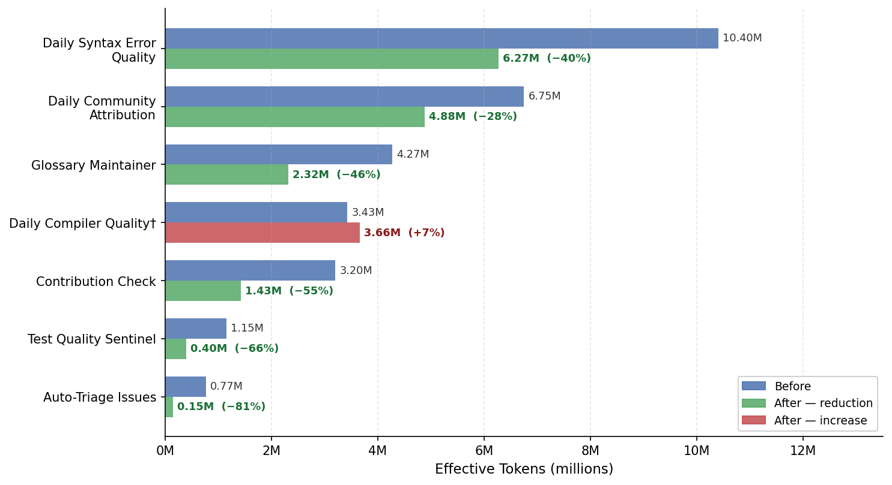

# Token efficiency in GitHub Agentic Workflows

*GitHub Blog draft — token-efficiency-paper branch*

---

**Deck / subtitle:**
Agentic workflows that run on every pull request can quietly accumulate large API bills. Here's how we instrumented our own production workflows, found the inefficiencies, and built agents to fix them.

---

GitHub Agentic Workflows are compelling because they are automated. They are like the a team of street sweepers that clean up little messes all over your repo. However, like all agentic work cost is a first-class concern. Unlike a chatbot that works under a user's watchful eye, an agentic workflow runs out of view and can compound across an entire team's activity. Running a workflow with a 150 K-token context on 50 pull requests every a day will eat into budget before anything has shipped.

There's a reason CI automation is a better place to start an efficiency campaign than interactive desktop use. A developer's session is hard to measure—the task changes minute to minute, the context is reactive, and there's no clean unit of work to normalize against. A GitHub Actions workflow is the opposite: its task is fully specified in YAML, it runs the same job on every trigger, and every run is an independent, comparable measurement. That repeatability is what makes systematic optimization tractable. You can run the same workflow before and after a change and directly compare the token footprint of each, confident that any difference reflects the change and not a different task.

We build and maintain GitHub Agentic Workflows as a live product in our own repository, and we worry about our own token efficiency as much as our users do. Over a 20-day period in April 2026, we ran 2,836 workflow executions spanning five different workflow types and systematically reduced per-run effective token consumption by 29% in our most frequently triggered workflow. This post describes how we did it: what we instrumented, what we found, and what we built to fix it.

## Efficiency dog-fooding

The repository that builds GitHub Agentic Workflows uses agentic workflows for its own CI. We have a Security Guard workflow that reviews every incoming pull request for security concerns, a Secret Digger that scans for credential leaks, smoke tests that validate the Copilot CLI and Claude CLI against every change, and a pair of daily advisor workflows that surface token usage trends and suggest optimizations. These aren't demos—they run on production hardware, against production GitHub API rate limits, and billed against a real budget.

That alignment between builder and user is intentional. The fastest path to understanding the real performance characteristics of a system is to depend on it yourself. When a workflow's context window grows by 20% because we accidentally added an unused MCP tool to the manifest, we see it in the bill before a user does. Running our own workflows gave us both the incentive to optimize and the data to measure it.

## Step one: log token usage at the API level

Before you can optimize token consumption, you need to see it. The obvious approach—reading application logs from the agent itself—has a fundamental problem: different agent frameworks (Claude CLI, Copilot CLI, Codex CLI) emit completely different log formats, and usage data is often incomplete or unavailable for historical runs.

We took a different approach. The agentic workflows architecture already includes an API proxy sidecar that injects LLM credentials into the agent container without exposing them to the agent process directly. This proxy sits between the agent and every upstream LLM provider call. By adding structured logging to the proxy, we capture token usage for every run, from every agent framework, in a single normalized format—without touching agent code at all.

Every workflow run now emits a `token-usage.jsonl` artifact: one record per LLM API call, recording input tokens, output tokens, cache-read tokens, cache-write tokens, model, provider, and timestamp. This single change turned token consumption from an invisible cost center into an action artifact.

## Let agents optimize agents

Token data in hand, the next question was what to do with it. Rather than analyze it manually, we built two optimization workflows that run on a daily schedule.

The **Daily Token Usage Auditor** reads token usage artifacts from all recent workflow runs, aggregates consumption by workflow and by time period, and posts a structured report. Its job is surveillance: flag any workflow that has significantly increased its token footprint since the last report, surface the most expensive workflows, and note any runs that look anomalous (e.g., a workflow that normally completes in 4 LLM turns taking 18).

The **Daily Token Optimizer** goes further. When the Auditor flags a heavy workflow, the Optimizer is given that workflow's source (the `.md` file and recent run logs) and asked to identify concrete inefficiencies and propose specific changes. It then creates a pull request with those changes. In practice, the Optimizer has become the highest-leverage tool in our efficiency toolkit: it consistently finds things that human reviewers miss.

Both workflows are themselves agentic workflows running inside the Agent Workflow Firewall, so their token usage also appears in the daily reports—a small but satisfying recursion.

## What the logs revealed: unused MCP tools

The single most common inefficiency the Optimizer identified was unused MCP tool registrations.

When an agent connects to an MCP server, the server's entire tool manifest—every available function, with its full JSON schema—is included in the system prompt of every LLM API call for the duration of the session. A GitHub MCP server with 40 registered tools can add 10–15 KB of JSON schema to every turn's context. If the workflow only uses 5 of those tools, the other 35 are dead weight on every call.

This turns out to be a very common pattern. Workflow authors naturally start with the full tool set available—it's the path of least resistance, and the agent can figure out which tools it needs. But in production, most workflows settle into a narrow, stable set of tool calls. The Optimizer identifies this pattern by cross-referencing the tool manifest against the actual tool calls recorded in the MCP gateway logs and recommends pruning unused tools from the configuration.

For our smoke test workflows, removing unused tools from the MCP configuration reduced the system prompt by 8–12 KB per call, saving several thousand context tokens per run with no change to behavior.

## Going further: replace GitHub MCP calls with gh CLI calls

Removing unused MCP tools is a relatively simple win. A larger structural opportunity was replacing GitHub data-fetching operations—reads that retrieve PR diffs, file contents, and review state—from MCP server tool calls to deterministic `gh` CLI subprocess calls.

The difference matters because an MCP tool call isn't just a data fetch. It's an LLM reasoning step: the agent must decide to call the tool, formulate its arguments, and receive its output as part of the context. That's a full round-trip LLM API call, consuming tokens for the tool-use JSON schema, the argument block, and the response. A `gh pr diff` subprocess call, by contrast, is a direct HTTP request to GitHub's REST API with no LLM involvement.

We used two strategies to make this migration:

**Pre-agentic data downloads.** For data the agent always needs—the PR diff, the list of changed files, relevant CI results—we added a setup step in the workflow that runs `gh` commands *before* the agent starts and writes the results to files in the workspace. The agent reads those files instead of making MCP calls. This is the most efficient approach because it eliminates the tool-call overhead entirely.

**In-agent CLI proxy substitution.** For cases where the agent determines at runtime which data to fetch, pre-downloading isn't always possible. Here we rely on the CLI proxy—a lightweight transparent HTTP proxy running in the agent container that routes `gh` CLI traffic through to GitHub's API without the agent ever seeing an authentication token. The agent runs `gh pr view --json` and gets structured data back, same as a user would from a terminal. The zero-secrets security property is preserved: the agent never has direct access to a GitHub PAT. It just gets the data.

Together, these approaches moved the majority of GitHub data-fetching out of the LLM reasoning loop, which reduces both token consumption and latency.

## Measuring efficiency is harder than it looks

Once we had token data flowing and optimizations shipping, we ran into a more subtle challenge: how do you know whether a change actually made things more efficient, versus just making the workflow *do less*?

Three confounding factors make this harder than it first appears.

**Not all tokens are created equal.** Running the same workflow on Claude Haiku versus Claude Sonnet produces token counts that look similar on paper but cost very differently. Haiku costs roughly 4× less per token than Sonnet, so a workflow that switches models appears "unchanged" in raw token counts but actually represents a significant cost reduction. To account for this, we use an Effective Tokens (ET) metric that applies model multipliers to each token type:

```
ET = m × (1.0 × I + 0.1 × C + 4.0 × O)
```

where *m* is a model cost multiplier (Haiku = 0.25×, Sonnet = 1.0×, Opus = 5.0×), *I* is newly-processed input tokens, *C* is cache-read tokens, and *O* is output tokens. Output tokens carry 4× weight because they are the most expensive token type across all major providers. Cache-read tokens carry only 0.1× weight because they are served from cache at a fraction of the cost of fresh input. This formula normalizes consumption across model tiers so that a 10% ET reduction means a genuine 10% cost reduction regardless of which model is in use.

**The workload is a live repository, not a benchmark.** The repositories under study are actively developed: pull requests merge, issues open, the codebase changes. A workflow that processes a 200-line PR diff genuinely uses more tokens than one processing a 5-line fix—that's not inefficiency, that's correct behavior. Raw token counts conflate workload variation with efficiency changes. We normalize by tracking LLM API call counts alongside token counts; if the number of LLM turns per run stays constant while tokens-per-call falls, that's a genuine efficiency improvement. If both fall together, it could mean less work is being done.

**Does quality change?** This is the hardest question. A lighter model running a more constrained workflow might produce lower-quality output. We looked at the process-level signals available in our dataset: output tokens per LLM call, turn counts per run, and tool-call completion rates. For Smoke Copilot—our most-optimized workflow—all three remained stable across the optimization period even as token consumption fell. The workflow completes in exactly 5 LLM turns every run, before and after the optimizations. But these are process signals, not outcome signals. We cannot directly observe whether the quality of agent output improved, degraded, or stayed flat, because we have no ground-truth labels for what "correct" output looks like. Measuring goodput—tokens per unit of correct work—requires outcome instrumentation that is on our roadmap.

## The numbers: actual results

After deploying the auditor and optimizer across twelve production workflows in the gh-aw project, we downloaded token-usage artifacts from runs before and after each optimization to measure actual impact in effective tokens (ET). Seven of the nine implemented optimizations have enough post-fix run history to compare:



*Before values (n=1–10) derived from optimizer issue analysis; after values measured from post-fix run artifacts. † Daily Compiler Quality: one post-fix outlier run (7.68M ET) inflates the average; the remaining 5 runs average 2.41M ET (−30%).*

The improvements range from modest (Daily Community Attribution, −28%) to dramatic (Auto-Triage Issues, −81%). The variation reflects the nature of the fix applied: simple toolset pruning saves less than eliminating whole categories of work.

Three patterns account for most of the gains.

**A single misconfigured rule can cause runaway loops.** The most extreme case was Daily Syntax Error Quality at 10.4 M ET per run—roughly 6× the project average. The root cause was a one-line misconfiguration: the workflow copied test files to `/tmp/` then called `gh aw compile *`, but the sandbox's bash allowlist only permitted relative-path glob patterns. Every compile attempt was blocked. Unable to use the tool it needed, the agent fell into a 64-turn fallback loop—manually reading source code to reconstruct what the compiler would have told it. One fix to the allowed bash patterns dropped consumption to 6.27 M ET (−40%). It's still high because the workflow itself tests many syntax error cases, but the runaway loop is gone.

**Unused tools are expensive to carry.** The Glossary Maintainer workflow was spending 4.27 M ET per run—and a single tool dominated: `search_repositories`, called **342 times in one run**, accounting for 58% of all tool calls. The tool came in as part of the default toolset but was completely unnecessary for a workflow that only scans local file changes. Removing it dropped average consumption to 2.32 M ET (−46%).

The Daily Community Attribution workflow showed the inverse: configured with 8 GitHub MCP tools, it made **zero calls to any of them** across an entire run while still spending 6.75 M ET—46% of its network requests were blocked. It had silently fallen back to reconstructing the same GitHub API calls through raw `curl` in a loop. The relatively modest −28% reduction after optimization reflects that this workflow's cost is largely driven by workload (78 turns of legitimate attribution computation) rather than tooling overhead alone.

**Most agent turns are deterministic data-gathering.** Contribution Check and Test Quality Sentinel show the largest proportional gains (−55% and −66%) because their inefficiency was structural: 50–96% of agent turns were spent on reads that required no inference—fetching PR diffs, listing changed files, reading a repository's CONTRIBUTING.md. Moving those reads into pre-agentic `gh` CLI steps before the agent starts eliminated the majority of the LLM work. Test Quality Sentinel went from 1.15 M ET to 400 K ET; Contribution Check from 3.2 M to 1.43 M.

## What's next?

The techniques described here—API-level observability, automated auditing workflows, MCP tool pruning, and CLI substitution—are all available today in the Agentic Workflows framework. The measurement methodology (workload normalization, effective tokens) is documented in the [Effective Tokens specification](https://github.com/github/gh-aw/blob/main/docs/src/content/docs/reference/effective-tokens-specification.md) and the data and analysis scripts for this study are published on the [`token-efficiency-paper`](https://github.com/github/gh-aw-firewall/tree/token-efficiency-paper) branch.

The open questions are genuinely hard: measuring goodput requires outcome instrumentation that doesn't yet exist at scale for agentic CI workflows. We're building toward it. In the meantime, the proxy-level observability and the optimizer workflows have already changed how we develop and deploy new agentic automations—we add token monitoring from day one rather than retrofitting it later.

If you're running agentic workflows in CI and wondering whether you're spending more than you need to, the first step is the same as ours: add the API proxy, turn on logging, and let the data tell you where to look.

We'd love to hear how others are approaching this problem. Share your thoughts in the [Community discussion](https://github.com/orgs/community/discussions/186451) or join the #agentic-workflows channel of the [GitHub Next Discord](https://gh.io/next-discord).
